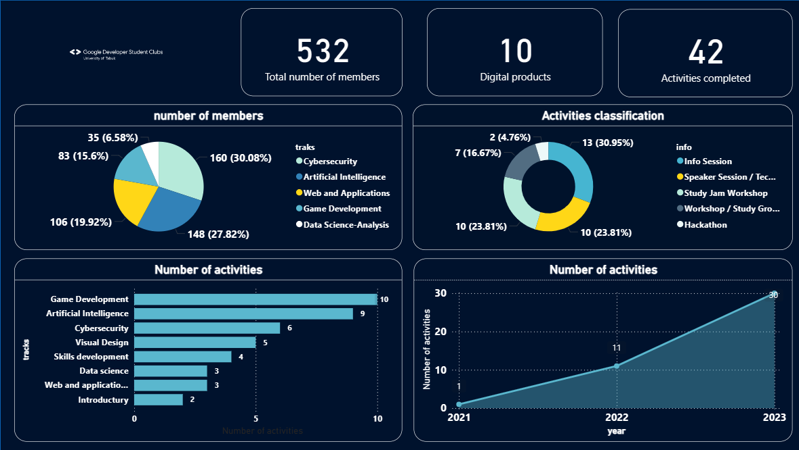

# Google Club Dashboard – Developer Students Tabuk 2023

## Overview
Dashboard providing analysis of activities and members of the Google Club. Shows events, total member count, and products developed or used.

## Features
- Overview of club activities and events
- Visualization of membership growth and engagement
- Interactive charts for product usage and activity trends
- Insights into club performance

## Technologies
Power BI Desktop, Excel/CSV, Data Modeling

## How to Run
1. Ensure Power BI Desktop is installed.
2. Download `GoogleClubDashboard.pbix`.
3. Open it using Power BI Desktop.

---

## Dashboard Screenshot 

*Note: This is a screenshot of the dashboard to give an idea of the project layout.*

---

## Notes 
- All data is anonymized and only represents numeric summaries. 
- Ensure your Power BI Desktop version is up-to-date for full compatibility.
